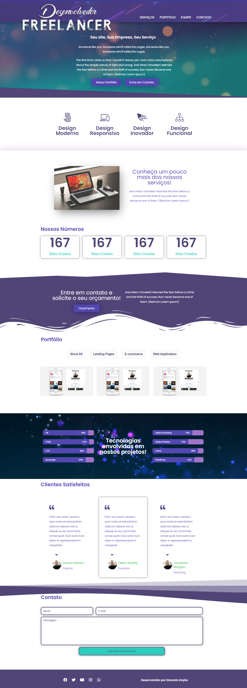

# Desenvolvedor Freelancer

## Sobre o projeto.
Esse projeto foi construído na minha hospedagem. Por tempo limitado.
<br><br>
Data de conclusão: 28/01/2022<br><br>
## Ferramentas e tecnologias usadas nesse projeto.
 
```js
function DesenvolvedorFreelancer(Project) {
    if (Front End) {
        const Stack = `${WordPress}`;
    }
};
```
<br>

<div align="center">



</div>

---

> - Autores: 
>   - [Eduardo Kayke](https://github.com/EduardoKayke "Perfil do Eduardo")

- [Voltar ao perfil do Github.](https://github.com/EduardoKayke "Perfil do Eduardo")

_Um dia seremos a tecnologia. Biohacking a própria evolução de nós mesmos._
